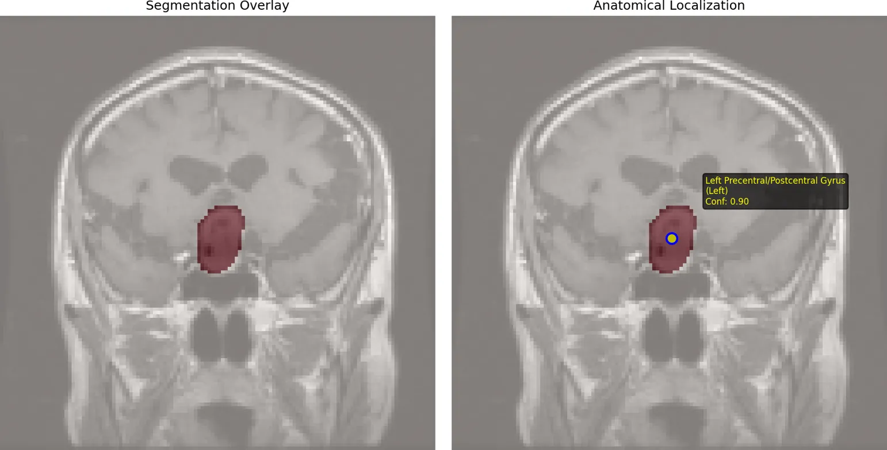

# 🧠 Medical Imaging RAG + Physics-Informed Neural Network (PINN)

## Overview
This project integrates **deep learning, physics-informed modeling, and retrieval-augmented generation (RAG)** for advanced analysis of brain MRI data.  
It unifies **tumor classification, segmentation, growth modeling, and biomedical literature retrieval** into a single pipeline for multi-perspective clinical reporting.

---

## Key Components
- **Tumor Classification**
  - Trained on **Figshare Brain Tumor Dataset** (meningioma, glioma, pituitary).
  - Achieved ~96% accuracy (DenseNet121).

- **3D Tumor Segmentation**
  - Trained on **BraTS2020 dataset** with 3D UNet.
  - Dice coefficient ~0.78–0.82 for tumor boundaries.

- **Physics-Informed Neural Network (PINN)**
  - Modeled tumor dynamics using **reaction–diffusion PDEs**.
  - Learned parameters: **diffusion coefficient (D), growth rate (ρ)**.
  - Simulated tumor progression with spatial and temporal dynamics.

- **Anatomical Localization**
  - Atlas-based mapping to cortical and subcortical regions.
  - Provided functional impact predictions (motor, sensory, language, etc.).

- **Biomedical RAG System**
  - Sources: **PubMed Central (full-text), Europe PMC, PubMed**.
  - Uses **Mistral LLM** + **PubMedBERT embeddings** with FAISS.
  - Generates **evidence-backed clinical insights** from literature.

---

## Learning Performance
Training progress for classifier, segmentation, and PINN components.

  
*Classifier accuracy/loss and segmentation Dice/loss.*

  
*PINN losses and parameter evolution (diffusion, growth).*

---

## Model Predictions & Visualizations
End-to-end system outputs combining classification, segmentation, PINN growth fields, and anatomical atlas localization.

  
* outputs: classifier, GT mask, 3D segmentation prediction, PINN fields.*

  
*Anatomical localization overlay showing tumor region and functional impact.*

---

## Project Highlights
- First-principles + data-driven fusion: **Deep Learning + Physics + Medical Literature**.
- Automated tumor reports containing:
  - **Type prediction**
  - **Anatomical location**
  - **Growth modeling & risk metrics**
  - **Relevant biomedical evidence**
- Proof-of-concept for next-gen AI-assisted diagnostics.

---

## Datasets
- **Figshare Brain Tumor MRI Dataset** – classification & 2D segmentation.
- **BraTS2020 Training Data** – multi-modal MRI volumes for 3D segmentation.
- **PubMed Central, Europe PMC, PubMed** – biomedical text retrieval.

---

## Tech Stack
- **Deep Learning**: PyTorch, MONAI  
- **Physics Modeling**: PINN (custom PDE-constrained training)  
- **Retrieval & NLP**: LangChain, HuggingFace, Ollama (Mistral)  
- **Vector DB**: FAISS  
- **Visualization**: Matplotlib  

---

## Status
✅ All modules implemented (classification, segmentation, PINN, RAG)  
⚠️ Current limitation: outputs sometimes inconsistent across modules (classification vs location vs growth).  
🎯 Future direction: tighter cross-module integration and self-consistency checks.

---

## Author
Developed by **Rohan Nambiar and P.R.N Samaikya Reddy** (2025).  
Focus: AI for medical imaging, physics-informed learning, and clinical decision support.
